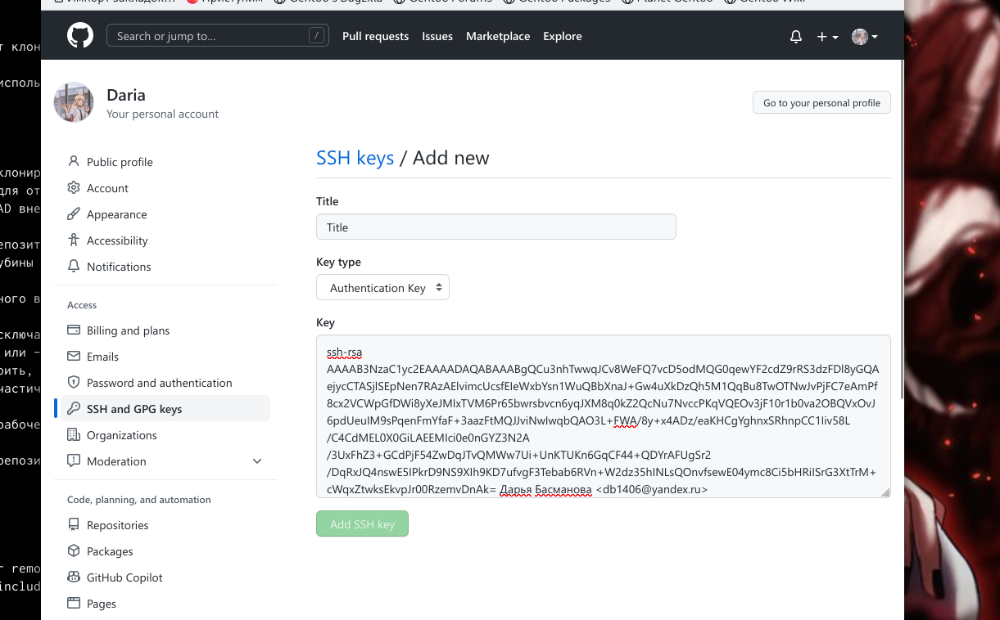
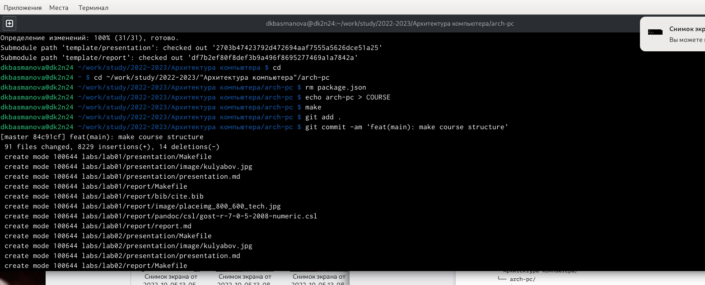
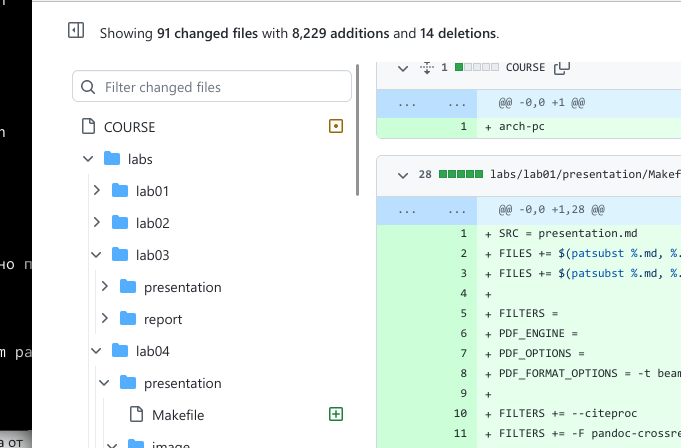

---
## Front matter
title: "Отчет по лабораторной работе №2"
subtitle: "Архитектура вычислительных систем"
author: "Басманова Дарья Кирилловна"

## Generic otions
lang: ru-RU
toc-title: "Содержание"

## Bibliography
bibliography: bib/cite.bib
csl: pandoc/csl/gost-r-7-0-5-2008-numeric.csl

## Pdf output format
toc: true # Table of contents
toc-depth: 2
lof: true # List of figures

fontsize: 12pt
linestretch: 1.5
papersize: a4
documentclass: scrreprt
## I18n polyglossia
polyglossia-lang:
  name: russian
  options:
	- spelling=modern
	- babelshorthands=true
polyglossia-otherlangs:
  name: english
## I18n babel
babel-lang: russian
babel-otherlangs: english
## Fonts
mainfont: PT Serif
romanfont: PT Serif
sansfont: PT Sans
monofont: PT Mono
mainfontoptions: Ligatures=TeX
romanfontoptions: Ligatures=TeX
sansfontoptions: Ligatures=TeX,Scale=MatchLowercase
monofontoptions: Scale=MatchLowercase,Scale=0.9
## Biblatex
biblatex: true
biblio-style: "gost-numeric"
biblatexoptions:
  - parentracker=true
  - backend=biber
  - hyperref=auto
  - language=auto
  - autolang=other*
  - citestyle=gost-numeric
## Pandoc-crossref LaTeX customization
figureTitle: "Рис."
tableTitle: "Таблица"
listingTitle: "Листинг"
lofTitle: "Список иллюстраций"
lolTitle: "Листинги"
## Misc options
indent: true
header-includes:
  - \usepackage{indentfirst}
  - \usepackage{float} # keep figures where there are in the text
  - \floatplacement{figure}{H} # keep figures where there are in the text
---

# Цель работы

Целью работы является изучить идеологию и применение средств контроля
версий. Приобрести практические навыки по работе с системой git.

# Задание

1. Скопироть отчеты по выполнению предыдущих лабораторных работ в
соответствующие каталоги созданного рабочего пространства.
3. Загрузите файлы на github.

# Теоретическое введение

Здесь описываются теоретические аспекты, связанные с выполнением работы.

Например, в табл. [-@tbl:std-dir] приведено краткое описание стандартных каталогов Unix.

: Описание некоторых каталогов файловой системы GNU Linux {#tbl:std-dir}

| Имя каталога | Описание каталога                                                                                                          |
|--------------|----------------------------------------------------------------------------------------------------------------------------|
| `/`          | Корневая директория, содержащая всю файловую                                                                               |
| `/bin `      | Основные системные утилиты, необходимые как в однопользовательском режиме, так и при обычной работе всем пользователям     |
| `/etc`       | Общесистемные конфигурационные файлы и файлы конфигурации установленных программ                                           |
| `/home`      | Содержит домашние директории пользователей, которые, в свою очередь, содержат персональные настройки и данные пользователя |
| `/media`     | Точки монтирования для сменных носителей                                                                                   |
| `/root`      | Домашняя директория пользователя  `root`                                                                                   |
| `/tmp`       | Временные файлы                                                                                                            |
| `/usr`       | Вторичная иерархия для данных пользователя                                                                                 |

Более подробно об Unix см. в [@gnu-doc:bash;@newham:2005:bash;@zarrelli:2017:bash;@robbins:2013:bash;@tannenbaum:arch-pc:ru;@tannenbaum:modern-os:ru].

# Выполнение лабораторной работы

Описываются проведённые действия, в качестве иллюстрации даётся ссылка на иллюстрацию (рис. [-@fig:001])

1) Для приобретения практических навыков по работе с системой git создадим учетную запись на сайте https://github.com/ и заполним основные данные.

{ #fig:001 width=90% }

Описываются проведённые действия, в качестве иллюстрации даётся ссылка на иллюстрацию (рис. [-@fig:002])

Сделаем конфигурацию git. Для этого откроем терминал и введем следующие команды указав имя и e-mail владельца репозитория.
Настроим utf-8 в выводе сообщений git
Зададим имя начальной ветки. Назовем ее master
Параметр autocrlf
Параметр safecrlf

{ #fig:002 width=90% }

Описываются проведённые действия, в качестве иллюстрации даётся ссылка на иллюстрацию (рис. [-@fig:003])

Для последующей идентификации пользователя на сервере репозиториев
необходимо сгенерировать пару ключей Ключи сохраняться в каталоге ~/.ssh/.

{ #fig:003 width=90% }

Описываются проведённые действия, в качестве иллюстрации даётся ссылка на иллюстрацию (рис. [-@fig:004])

Для того чтобы загрузить сгенерированный открытый ключ нужно зайти на
сайт github под своей учетной записью и перейти в меню Setting. Далее выбираем
в боковом меню SSH and GPG keys и нажимаем кнопку New SSH key

Копируем из локальной консоли ключ в буфер обмена

Вставляем ключ в появившимся на сайте поле и указываем для ключа имя Title.

{ #fig:004 width=90% }

Описываются проведённые действия, в качестве иллюстрации даётся ссылка на иллюстрацию (рис. [-@fig:005])

Открываем терминал и создаем каталог для предмета «Архитектура
компьютера».
Создадим репозиторий на основе шаблона через web- интерфейс github.
Для этого:
Переходим на страницу репозитория с шаблоном курса
https://github.com/yamadharma/course-directory-student-template.
Далее выбираем кромку Use this template.
 В открывшимся окне задаем имя репозитория (study_2022–2023_arh-pc) и создаем репозиторий:
 
 
{ #fig:005 width=90% }
 
 
Описываются проведённые действия, в качестве иллюстрации даётся ссылка на иллюстрацию (рис. [-@fig:008])
 
 Копируем созданный репозиторий с помощью клонирования нажав на
кнопку Code -> SSH.
(На скриншоте показана часть выполнения действия).

{ #fig:008 width=90% }

Описываются проведённые действия, в качестве иллюстрации даётся ссылка на иллюстрацию (рис. [-@fig:009])

Удаляем лишние файлы
Создаем необходимые каталоги
Отправляем файлы на сервер (на скриншотах показана часть выполнения
действий).
Проверяем правильность создания иерархии рабочего пространства
в локальном репозитория и на странице github.

{ #fig:009 width=90% }

Описываются проведённые действия, в качестве иллюстрации даётся ссылка на иллюстрацию (рис. [-@fig:010])

{ #fig:010 width=90% }

Описываются проведённые действия, в качестве иллюстрации даётся ссылка на иллюстрацию (рис. [-@fig:011])
 
{ #fig:011 width=90% }
 
# Выводы

В ходе выполнения данной лабораторной работы я изучила идеологию
и применение средств контроля версий. Приобрела практические навыки по работе
с системой git.

# Список литературы{.unnumbered}

::: {#refs}
:::
