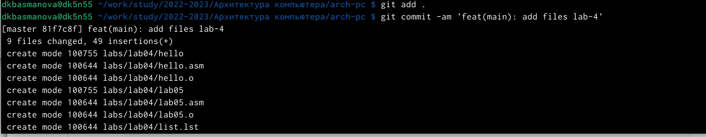

---
## Front matter
title: "Лабораторная работа №4"
subtitle: "Архитектура вычислительных систем"
author: "Басманова Дарья Кириллова"

## Generic otions
lang: ru-RU
toc-title: "Содержание"

## Bibliography
bibliography: bib/cite.bib
csl: pandoc/csl/gost-r-7-0-5-2008-numeric.csl

## Pdf output format
toc: true # Table of contents
toc-depth: 2
lof: true # List of figures

fontsize: 12pt
linestretch: 1.5
papersize: a4
documentclass: scrreprt
## I18n polyglossia
polyglossia-lang:
  name: russian
  options:
	- spelling=modern
	- babelshorthands=true
polyglossia-otherlangs:
  name: english
## I18n babel
babel-lang: russian
babel-otherlangs: english
## Fonts
mainfont: PT Serif
romanfont: PT Serif
sansfont: PT Sans
monofont: PT Mono
mainfontoptions: Ligatures=TeX
romanfontoptions: Ligatures=TeX
sansfontoptions: Ligatures=TeX,Scale=MatchLowercase
monofontoptions: Scale=MatchLowercase,Scale=0.9
## Biblatex
biblatex: true
biblio-style: "gost-numeric"
biblatexoptions:
  - parentracker=true
  - backend=biber
  - hyperref=auto
  - language=auto
  - autolang=other*
  - citestyle=gost-numeric
## Pandoc-crossref LaTeX customization
figureTitle: "Рис."
tableTitle: "Таблица"
listingTitle: "Листинг"
lofTitle: "Список иллюстраций"
lotTitle: "Список таблиц"
lolTitle: "Листинги"
## Misc options
indent: true
header-includes:
  - \usepackage{indentfirst}
  - \usepackage{float} # keep figures where there are in the text
  - \floatplacement{figure}{H} # keep figures where there are in the text
---

# Цель работы

Целью работы является освоение процедуры оформления отчетов с помощью
легковесного языка разметки Markdown.

# Задание

1. В соответствующем каталоге сделайте отчёт по лабораторной работе №4 
в формате Markdown. В качестве отчёта необходимо предоставить отчёты
в 3 форматах: pdf, docx и md.
2. Загрузите файлы на github.

# Выполнение лабораторной работы

Описываются проведённые действия, в качестве иллюстрации даётся ссылка на иллюстрацию (рис. [-@fig:001])

1) Рассмотрим пример простой программы на языке ассемблера NASM. 
Создадим каталог для работы с программами на языке ассемблера NASM.

{ #fig:001 width=95% }

Описываются проведённые действия, в качестве иллюстрации даётся ссылка на иллюстрацию (рис. [-@fig:002])

2) Перейдем в созданный каталог и создадим текстовый файл с именем hello.asm. 

{ #fig:002 width=95% } 

Описываются проведённые действия, в качестве иллюстрации даётся ссылка на иллюстрацию (рис. [-@fig:003])

3) Откроем этот файл с помощью любого текстового редактора и введем следующий текст.

{ #fig:003 width=95% } 

Описываются проведённые действия, в качестве иллюстрации даётся ссылка на иллюстрацию (рис. [-@fig:004])

4) NASM превращает текст программы в объектный код. Для компиляции приведённого выше текста программы «Hello World» напишем nasm -f elf hello.asm 

{ #fig:004 width=95% } 

# Выполнение самостоятельной работы

Описываются проведённые действия, в качестве иллюстрации даётся ссылка на иллюстрацию (рис. [-@fig:005])

1) В каталоге ~/work/arch-pc/lab05 с помощью команды cp создадим копию файла hello.asm с именем lab5.asm.

{ #fig:005 width=95% }

Описываются проведённые действия, в качестве иллюстрации даётся ссылка на иллюстрацию (рис. [-@fig:006])

2) С помощью любого текстового редактора внесем изменения в текст программы в файле lab5.asm так, чтобы вместо Hello world! на экран выводилась строка с фамилией и именем.

{ #fig:006 width=95% }

Описываются проведённые действия, в качестве иллюстрации даётся ссылка на иллюстрацию (рис. [-@fig:007])

3) Оттранслируем полученный текст программы lab5.asm в объектный файл и запустим. 

{ #fig:007 width=95% }

Описываются проведённые действия, в качестве иллюстрации даётся ссылка на иллюстрацию (рис. [-@fig:008])

4) Загружаем файлы на GitHub. 

{ #fig:008 width=95% }

# Выводы

Я освоила процедуру компиляции и сборки программ, написанных на ассемблере NASM.

# Список литературы{.unnumbered}

::: {#refs}
:::
