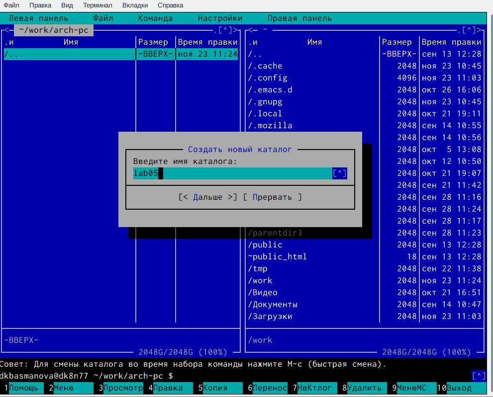
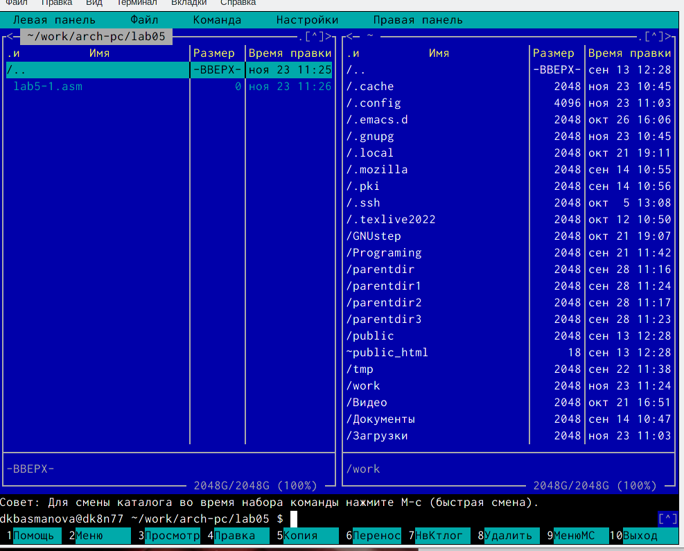
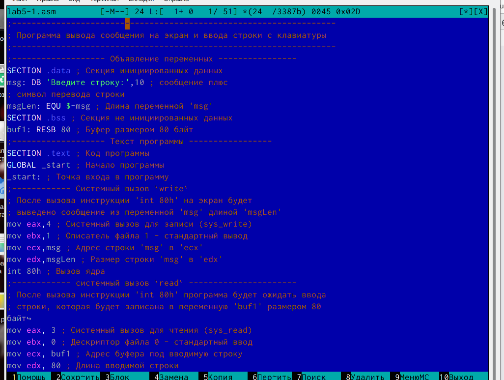
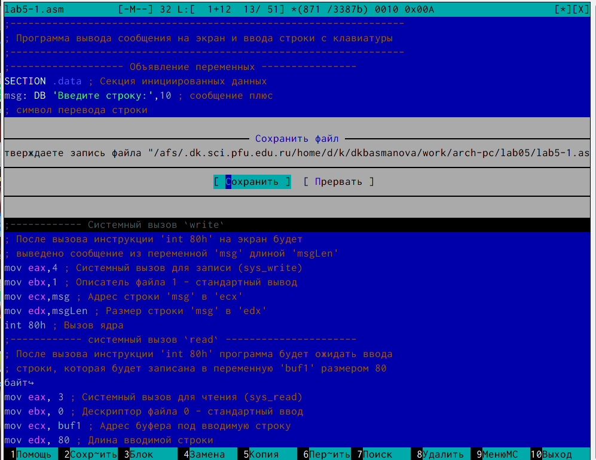
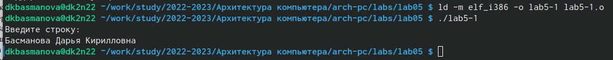
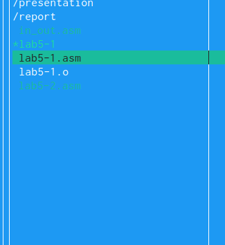
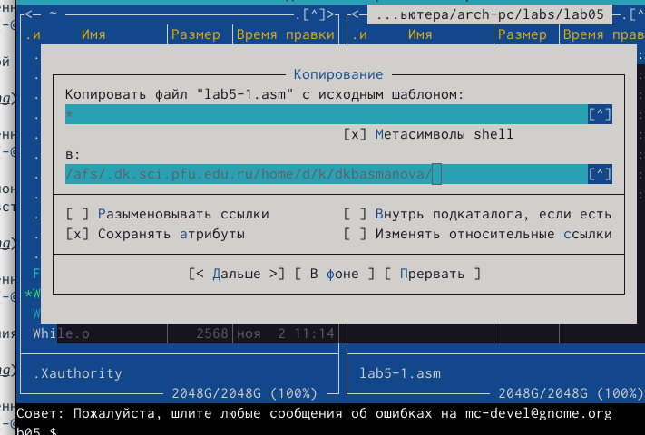
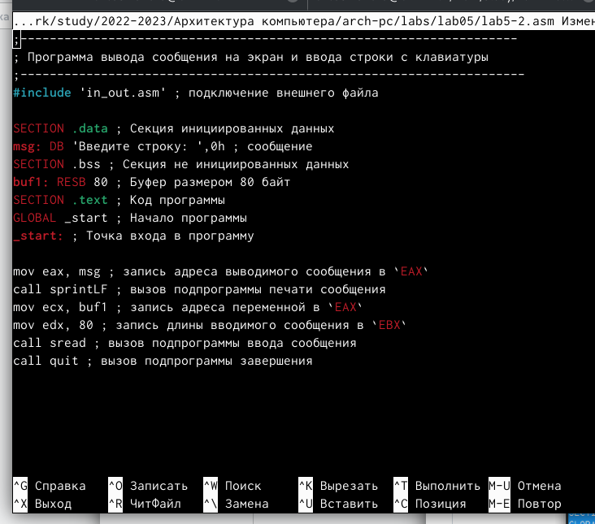

---
## Front matter
title: "Лабораторная работа №5"
subtitle: "Архитектура вычислительных систем"
author: "Басманова Дарья Кириллова"

## Generic otions
lang: ru-RU
toc-title: "Содержание"

## Bibliography
bibliography: bib/cite.bib
csl: pandoc/csl/gost-r-7-0-5-2008-numeric.csl

## Pdf output format
toc: true # Table of contents
toc-depth: 2
lof: true # List of figures

fontsize: 12pt
linestretch: 1.5
papersize: a4
documentclass: scrreprt
## I18n polyglossia
polyglossia-lang:
  name: russian
  options:
	- spelling=modern
	- babelshorthands=true
polyglossia-otherlangs:
  name: english
## I18n babel
babel-lang: russian
babel-otherlangs: english
## Fonts
mainfont: PT Serif
romanfont: PT Serif
sansfont: PT Sans
monofont: PT Mono
mainfontoptions: Ligatures=TeX
romanfontoptions: Ligatures=TeX
sansfontoptions: Ligatures=TeX,Scale=MatchLowercase
monofontoptions: Scale=MatchLowercase,Scale=0.9
## Biblatex
biblatex: true
biblio-style: "gost-numeric"
biblatexoptions:
  - parentracker=true
  - backend=biber
  - hyperref=auto
  - language=auto
  - autolang=other*
  - citestyle=gost-numeric
## Pandoc-crossref LaTeX customization
figureTitle: "Рис."
tableTitle: "Таблица"
listingTitle: "Листинг"
lofTitle: "Список иллюстраций"
lotTitle: "Список таблиц"
lolTitle: "Листинги"
## Misc options
indent: true
header-includes:
  - \usepackage{indentfirst}
  - \usepackage{float} # keep figures where there are in the text
  - \floatplacement{figure}{H} # keep figures where there are in the text
---

# Цель работы

Преобретение практических навыков работы с программой ассемблер, Midnight Commander.

# Задание

1. Создайть копию файла и внесите изменения в программу, так чтобы она работала по
следующему алгоритму:
• вывести приглашение типа “Введите строку:”;
• ввести строку с клавиатуры;
• вывести введённую строку на экран.
2. Получить исполняемый файл и проверить его работу. На приглашение
ввести строку введите свою фамилию.
3. Создайть копию файла и исправьте текст программы с использование подпрограмм из внешнего файла in_out.asm, так чтобы она работала по следующему алгоритму:
• вывести приглашение типа “Введите строку:”;
• ввести строку с клавиатуры;
• вывести введённую строку на экран

# Выполнение лабораторной работы

Описываются проведённые действия, в качестве иллюстрации даётся ссылка на иллюстрацию (рис. [-@fig:001])

1) Откроем Midnight Commander и с помощью функциональной клавиши F7 создадим папку lab05 и перейдем в данный каталог.

{ #fig:001 width=95% }

Описываются проведённые действия, в качестве иллюстрации даётся ссылка на иллюстрацию (рис. [-@fig:002])

2) Пользуясь строкой ввода и командой touch создадим файл lab5-1.asm.

{ #fig:002 width=95% }

Описываются проведённые действия, в качестве иллюстрации даётся ссылка на иллюстрацию (рис. [-@fig:003])

3) С помощью функциональной клавиши F4 откроем файл lab6-1.asm для
редактирования во встроенном редакторе.

{ #fig:003 width=95% }

Описываются проведённые действия, в качестве иллюстрации даётся ссылка на иллюстрацию (рис. [-@fig:004])

4) Сохраним изменения

{ #fig:004 width=95% }

Описываются проведённые действия, в качестве иллюстрации даётся ссылка на иллюстрацию (рис. [-@fig:005])

5) Оттранслируем текст программы lab6-1.asm в объектный файл. Выполняем компоновку и щапускаем. Вводим ФИО.

{ #fig:005 width=95% }

Описываются проведённые действия, в качестве иллюстрации даётся ссылка на иллюстрацию (рис. [-@fig:006])

6) Скачаем файл in_out.asm со страницы в ТУИС и переместим его в файл с программой.

{ #fig:006 width=95% }

Описываются проведённые действия, в качестве иллюстрации даётся ссылка на иллюстрацию (рис. [-@fig:007])

7) С помощью функциональной клавиши F6 создаем копию файла lab5-1.asm с именем lab5-2.asm. 

{ #fig:007 width=95% }

8) При замене подпрограммы sprintLF на spint текст выводится на той же строке, где расположена фраза "Введите строку", а не на отдельной.

# Выполнение самостоятельной работы
 
 Описываются проведённые действия, в качестве иллюстрации даётся ссылка на иллюстрацию (рис. [-@fig:008])
 
1) Создадим копию файла lab5-1.asm и назовем его lab5-3.asm и внесем изменения, так чтобы она работaла по определенному алгоритму.
 
{ #fig:008 width=95% }
 
 
 
# Выводы

После выполнения работы я получила практические знания работы в Midnight Commander. А так же освоила инструкции языка ассембрела mov и int 

::: {#refs}
:::
